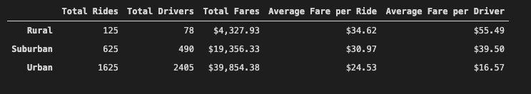
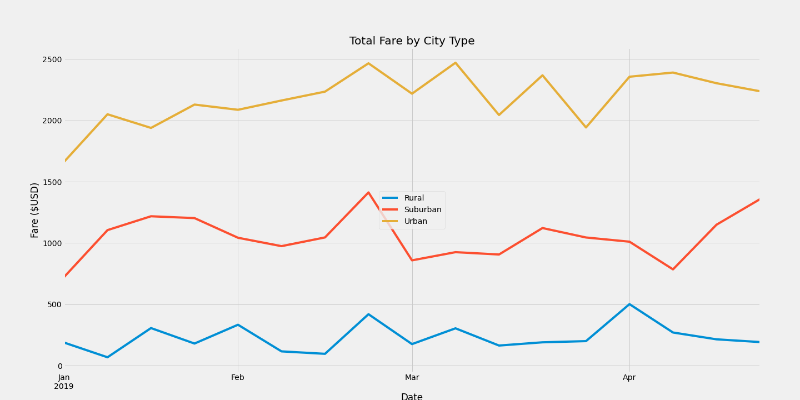

# PyBer_Analysis

## Overview of the Analysis
The purpose of the new analysis for V. Isualize was to utilize Python and Pandas to create a summary DataFrame by city type using PyBer’s ride-sharing data.  We also wanted to utilize Matplotlib, as well, to create a multiple-line graph that shows weekly fares over time by city type using PyBer’s ride-sharing data.  By providing and analyzing these two new data visualization tools for PyBer, we can spot treads and highlight disparities in the ride-sharing data for the CEO to address.

## Results
While analyzing the ride-sharing data by city type I noticed major differences and between the three city types.  First, the urban city type had 875 more rides than the suburban and rural city types combined and the urban city type has 1,837 more drivers than the suburban and rural city types combined.  The urban city type made up about 63% ($39,854.38) of the total combined fares from the three city types with suburban making about 30% ($19,356.33) and rural only making up about less than 7% ($4,327.93) of the total combined fares for PyBer.  The total fare per ride was similar between rural with $34.62 per ride and suburban $30.97 per ride while urban had a lower fare per ride with $24.53 per ride.  The average fare per driver was as expected very high for the rural city type with $55.49 per ride, suburban city type was $39.50 per driver and urban was much less per ride at only $16.57 per ride.

By creating a multiple-line graph of the total fare by city type we could easily visualize the differences by city type over time.  The total weekly fare for each city type were used as the values for the graph.  Analyzing the graph, it’s clear that the urban areas consistently had more fares over time than both suburban and rural areas.  Rural areas clearly made up the least number of fares over time between the three different city types using PyBer’s ride-sharing data.

## Summary
Based on the results, there are three business recommendations I would like to provide to the CEO by addressing the disparities among the three city types.
- Urban city areas are, by far, where most of PyBer’s business comes from, including total rides, drivers and fares, and PyBer should provide the most resources to this area and this area should be PyBer’s top priority.
- Suburban city areas had fewer total fares over time than urban areas but still made up a considerable amount of PyBer’s combined total fares at about 30%, so PyBer should consider placing a surcharge or extra fee amount to business in suburban areas to increase the fares amount in this area closer to that in urban areas.
- Rural city areas clearly made up the least number of fares over time and although rural areas had the highest average fare per driver, that only resulted in about 7% of the total combined fare amount. If posable, PyBer should move drivers and other recourses from the rural areas and into urban and suburban areas where more business is present.
